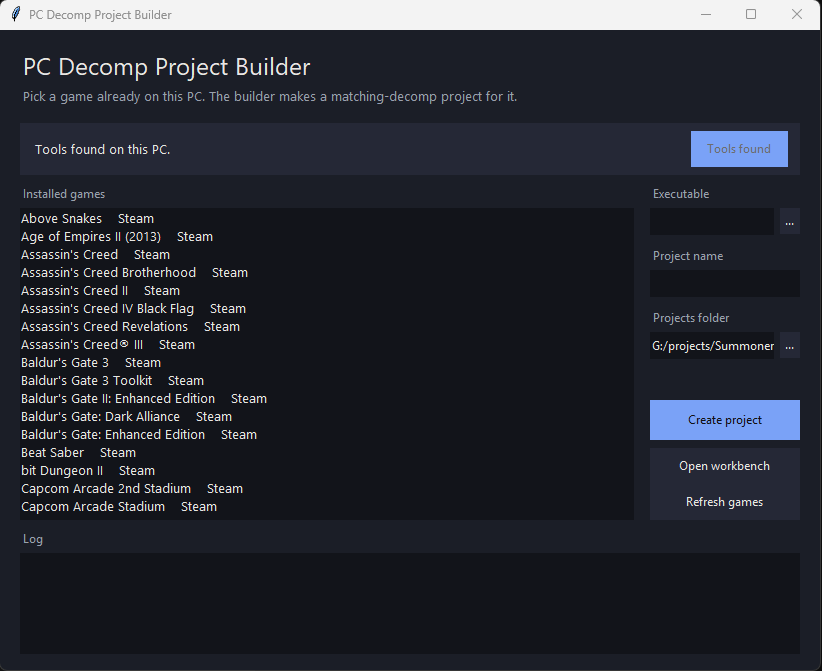
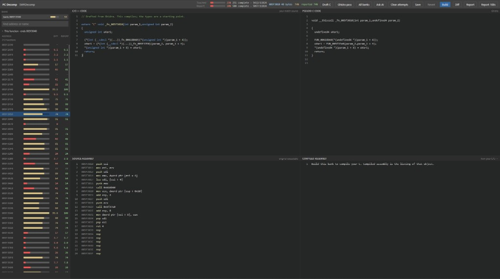

# PC decomp template

**Work in progress.** PC Decomp Project Builder and the local workbench are available. Double-click `install.bat` to open the builder. The steps after a project exists are in [docs/walkthrough.md](docs/walkthrough.md). The matching flow is still changing.

This repository is a [GitHub template](https://docs.github.com/en/repositories/creating-and-managing-repositories/creating-a-repository-from-a-template). Use it to start a new project. It does not contain a game or decompiled source.

## PC Decomp Project Builder

The builder is the window that starts a project. It lists Steam and GOG games already on this PC. Install tools once, pick a game, name the project, and choose a folder. **Create project** copies the executable and fills in the SHA1. **Open workbench** opens the page for that project. `install.py` is the same setup as a prompt, if you do not want the window.



## Workbench

The workbench is a local page for one function. The list shows each address with its diff score and report score. The four panes are your C/C++, Ghidra pseudo C, assembly from the original executable, and assembly compiled from your C.



```text
config/project.json       which Steam or GOG install to search
config/dtk.yml            executable name and SHA1 for the splitter
config/splits.txt         address range of each unit
config/dtk_symbols.txt    function names
config/modules.txt        original source paths from the executable
src/                      C and C++
include/                  headers
orig/                     local executable, not committed
notes/                    scores
docs/walkthrough.md       the steps, in order
install.bat               opens PC Decomp Project Builder
builder_app.py            the window: tools, installed games, new project
tools/setup.py            downloads Ninja, objdiff, decomp-toolkit, Binary Ninja Free, MSVC 6
tools/find_game.py        copies the executable out of Steam or GOG
.github/workflows/        empty until a split builds
```
